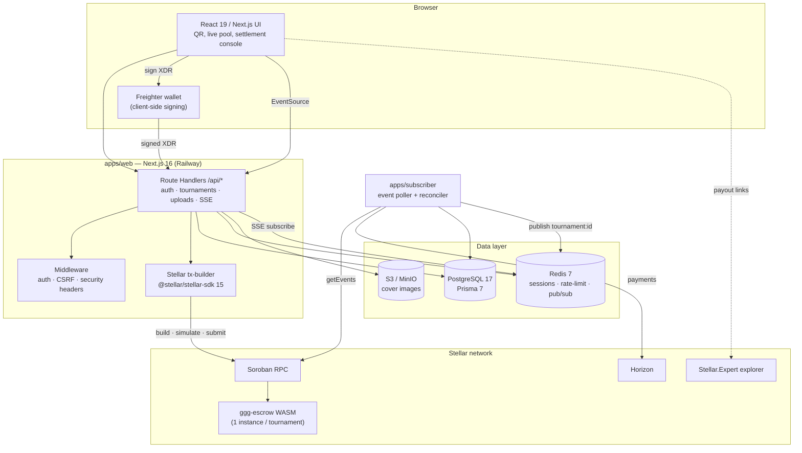
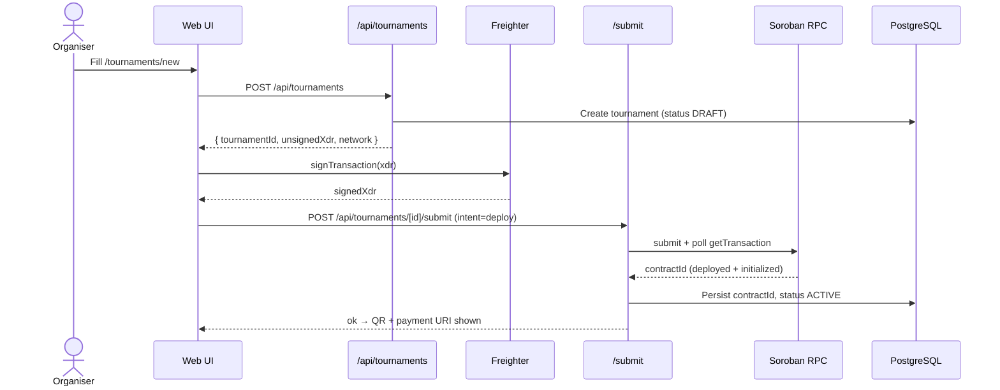
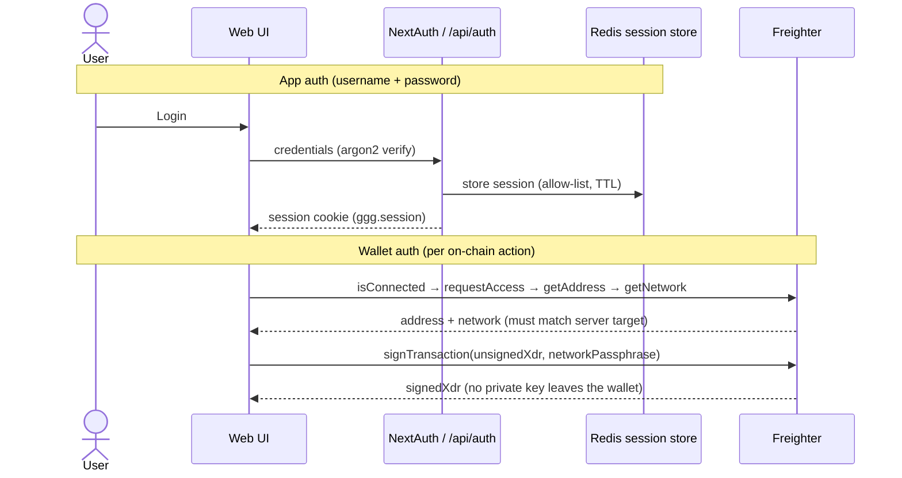
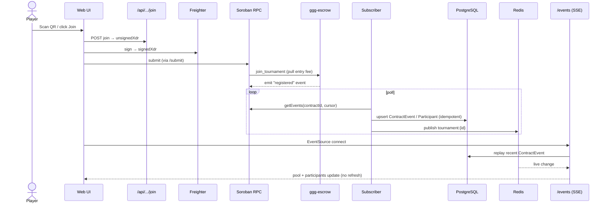

# GGG — Good Game Guild

> Trustless tournament prize-escrow on Stellar Soroban — the contract holds the money, not a custodian.

GGG lets a tournament **organiser** spin up an on-chain prize pool, lets **players** join by paying a crypto entry fee straight into a Soroban smart contract, and lets a **referee** submit final rankings — after which the contract itself pays the winners a configurable split (default 60/30/10). The hero flow: create a tournament → a QR code appears → wallets scan and fund the pool live → the referee settles → three payout transactions land on the Stellar explorer, all in under two minutes.

---

## Status / License

| | |
|---|---|
| **Version** | `0.0.0` (root/workspace manifests) · contract crate `ggg-escrow` `0.1.0` |
| **Status** | Code-complete across build phases 0–6; verified locally on Stellar **Testnet**. Live deploy pending. [inferred from `docs/features.md`, `docs/definition-of-done.md`] |
| **Default network** | Stellar Testnet (`STELLAR_NETWORK=testnet`) |
| **Uploaded escrow WASM hash** | `c6952e467e6a5a7c7599db3276fb98fcb7e97d2fb438670c649e8340830cd818` (committed in `apps/web/.env.example`) |
| **License** | `[PLACEHOLDER: no LICENSE file found in repo — add one]` |

---

## Problem

Every paid tournament has a pot of money, and today **someone has to hold it** — the organiser or a platform acts as custodian of the entry fees until payout. Per [`SPEC.md`](./SPEC.md) §1, that custody is a single point of trust and failure:

- Funds can be skimmed, delayed, frozen, or disappear.
- Players must trust a stranger to pay out correctly, in full, and on time.
- Grassroots and community tournaments have **no affordable, neutral escrow**.

GGG removes the custodian: **no party holds the funds — the contract does.** Money leaves the escrow **only** via winner payout or refund; there is no withdraw function.

---

## Vision / Purpose

- **Long-term:** a game-agnostic, trustless prize-escrow and match-settlement protocol for competitive gaming — "any game title," per [`SPEC.md`](./SPEC.md) §1.
- **Why built:** a hackathon-style, spec-driven build ([`SPEC.md`](./SPEC.md) is the authoritative build spec; [`docs/`](./docs) tracks a phased 0–6 roadmap). [inferred: hackathon framing — see [PITCH_DECK.md](./PITCH_DECK.md)]
- **Design principle:** the server never holds a private key. It only builds, simulates, submits, and reads transactions; signing happens client-side in the user's wallet ([`SPEC.md`](./SPEC.md) §7).

---

## Target Users

- **Tournament organisers** — need neutral escrow without becoming (or paying for) a custodian.
- **Players / competitors** — want provable, on-chain payouts and no app account required to join ([`SPEC.md`](./SPEC.md) §1 actors).
- **Referees** — submit final rankings; their authority is enforced on-chain by wallet address.
- **Gaming guilds / communities / LAN & arcade events** — run frequent paid brackets that can't justify a custodial platform. [inferred]

---

## Features

**Tournaments**
- Create a tournament with entry fee, asset (XLM or USDC), referee address, and a 1st/2nd/3rd split stored as basis points that must sum to 10000.
- Public tournament detail page: live prize-pool counter, participant list, winners panel with explorer links.
- Organiser dashboard (list with status chips), referee **settlement console**, and an **admin** dashboard.

**On-chain money rails (Soroban)**
- One WASM escrow contract deployed per tournament; entry fees pulled into escrow on join.
- Referee-signed finalisation pays the configured split in a single transaction, with rounding dust deterministically assigned to 1st place.
- Organiser-signed cancellation refunds every registered player before finalisation.

**Wallet + funding**
- Client-side signing via **Freighter** (`@stellar/freighter-api`); server never sees a key.
- **SEP-7 QR** code + payment URI on every active tournament so any SEP-7 wallet can scan and fund ([`SPEC.md`](./SPEC.md) §8).

**Live state**
- Background **event subscriber** polls Soroban RPC events + reconciles Horizon payments, then pushes updates over **Server-Sent Events (SSE)** — pool and participants update without a refresh.

**Platform / security**
- Username+password auth: `argon2` hashing, session cookie, revocable Redis session store, CSRF (same-origin) checks, and Redis-backed rate limiting.
- S3-compatible cover-image uploads via presigned URLs (MinIO locally).
- Zod-validated, fail-closed environment loaders in both `apps/web` and `apps/subscriber`.

---

## Architecture



---

## Sequence Diagrams

### 1. Hero flow — create tournament (organiser)



### 2. Auth / signing flow (Freighter + credentials)



### 3. Player join + live event propagation (async / SSE)



---

## Smart Contracts

Contract crates found in the repo:

| Crate | Path | Purpose (inferred from source) |
|---|---|---|
| `ggg-escrow` | [`contracts/escrow`](./contracts/escrow) | Per-tournament prize escrow: `initialize`, `join_tournament`, `finalize_results`, `cancel_tournament`, and read-only `get_pool` / `get_reward` / `is_finished`. Emits `registered` / `finalized` / `cancelled` events. Built with `soroban-sdk` 26. |

<!-- PLACEHOLDER: Soroban smart contracts — document each contract's purpose, public functions, parameters, and deployment/upload process here. -->

> Reference for filling in the placeholder: function signatures, storage model, events, and security invariants are specified in [`SPEC.md`](./SPEC.md) §4; the source of truth is `contracts/escrow/src/lib.rs` with 28 tests in `contracts/escrow/src/test.rs`.

---

## Tech Stack

Versions are taken from the manifests (`apps/web/package.json`, `apps/subscriber/package.json`, `contracts/escrow/Cargo.toml`).

| Layer | Tech |
|---|---|
| **Frontend** | Next.js `^16.2.9` (App Router), React `^19.2.7`, Tailwind CSS `^4.3.1` (`@tailwindcss/postcss`), shadcn/Radix UI, `lucide-react`, `qrcode.react` |
| **Backend / API** | Next.js Route Handlers, Zod `^4`, Prisma `^7.8.0` (`@prisma/adapter-pg`), `ioredis`, NextAuth `4.24.14`, `argon2` |
| **Blockchain client** | `@stellar/stellar-sdk` `15`, `@stellar/freighter-api` `^6.0.1` |
| **Smart contract** | Rust, `soroban-sdk` `26`, `stellar-cli` `27.0.0` (CI), compiled to WASM |
| **Storage** | `@aws-sdk/client-s3` + `s3-request-presigner` `^3` (MinIO local / S3-compatible prod) |
| **Data** | PostgreSQL 17, Redis 7 |
| **Subscriber** | TypeScript worker (`tsx`), `@stellar/stellar-sdk`, `ioredis`, Prisma (shared via `web` workspace dep) |
| **Tooling** | pnpm 10 (`pnpm@10.6.4`), Node 22 (`.nvmrc`), TypeScript `^6`, Vitest `^4`, Playwright `^1.61`, ESLint `^9`, Prettier `^3` |
| **CI** | GitHub Actions — `app` job (Postgres+Redis, typecheck/lint/format/tests/integration/build/audit) and `contract` job (stellar-cli build + `cargo test`) |
| **Infra / deploy** | Railway (`railway.json` per service), Docker Compose (local), MinIO |

> Note: version numbers reflect this repo's manifests as committed; report them as-is.

---

## How to Run Locally

**Prerequisites:** Node **22+** (`.nvmrc`), **pnpm 10** (via corepack), **Docker**. For contract work: Rust + `stellar-cli`.

```bash
# 1. Enable pnpm and install
corepack enable
pnpm install

# 2. Start local services (Postgres 17, Redis 7, MinIO + bucket bootstrap)
docker compose up -d

# 3. Configure web env
cp apps/web/.env.example apps/web/.env
#   then fill: SESSION_SECRET (>=32), CSRF_SECRET (>=32), ADMIN_PASSWORD (>=8)

# 4. Database: migrate + seed the admin user
pnpm --filter web db:migrate
pnpm --filter web db:seed

# 5. Run the web app  → http://localhost:3000
pnpm --filter web dev

# 6. (Optional) run the event subscriber in a second shell
pnpm --filter subscriber dev
```

**Quality gates (match CI):**

```bash
pnpm -r typecheck
pnpm -r lint
pnpm format:check
pnpm --filter web test
pnpm --filter web test:integration    # needs Postgres + Redis up
pnpm --filter web build               # production build
```

**Contract build & tests:**

```bash
cd contracts/escrow
stellar contract build
cargo test
```

### Environment variables

**`apps/web` — required** (fail-closed, validated by `apps/web/src/lib/env.ts`):
`APP_URL`, `SESSION_SECRET` (≥32), `CSRF_SECRET` (≥32), `DATABASE_URL`, `REDIS_URL`, `ADMIN_USERNAME`, `ADMIN_PASSWORD` (≥8), `STELLAR_NETWORK` (`testnet`|`public`), `SOROBAN_RPC_URL`, `HORIZON_URL`, `NETWORK_PASSPHRASE`, `S3_ENDPOINT`, `S3_REGION`, `S3_BUCKET`, `S3_ACCESS_KEY_ID`, `S3_SECRET_ACCESS_KEY`.

**`apps/web` — optional:** `ESCROW_WASM_HASH`, `NATIVE_SAC_ADDRESS`, `USDC_ISSUER`, `USDC_SAC_ADDRESS`, `S3_FORCE_PATH_STYLE` (default `false`), `NODE_ENV` (default `development`).
- Without `ESCROW_WASM_HASH` / `NATIVE_SAC_ADDRESS`, contract deploy/XLM asset resolution can't be performed. [inferred]
- Without `USDC_ISSUER` / `USDC_SAC_ADDRESS`, only XLM entry fees resolve; USDC is unavailable. [inferred]

**`apps/subscriber`** (validated by `apps/subscriber/src/env.ts`): `DATABASE_URL`, `REDIS_URL`, `SOROBAN_RPC_URL`, `HORIZON_URL`, `NETWORK_PASSPHRASE` (all required); `POLL_INTERVAL_MS` (optional, default `5000`), `NODE_ENV` (default `development`).

---

## Deployment

Deploys to **Railway** as three services (configs committed; provisioning/`railway up` is an operator step — see [`RUNBOOK.md`](./RUNBOOK.md)):

| Service | Config | Build | Start / release hook |
|---|---|---|---|
| **web** | [`apps/web/railway.json`](./apps/web/railway.json) | NIXPACKS: `db:generate && build` | `next start`; preDeploy: `prisma migrate deploy && prisma db seed`; healthcheck `/api/auth/me` |
| **subscriber** | [`apps/subscriber/railway.json`](./apps/subscriber/railway.json) | NIXPACKS: `db:generate` | `subscriber start` (`tsx`), `restartPolicy: ALWAYS` |
| **file-storage** | [`infra/file-storage/railway.json`](./infra/file-storage/railway.json) | DOCKERFILE (MinIO) | S3-compatible store on a Railway Volume |

**CI** ([`.github/workflows/ci.yml`](./.github/workflows/ci.yml)): the `app` and `contract` jobs must pass on PRs (branch protection is a one-time maintainer step, documented in the workflow + [`RUNBOOK.md`](./RUNBOOK.md)). Playwright E2E runs out-of-band against Testnet, not on the merge gate.

- **Live web URL:** `[PLACEHOLDER: Live app URL]`
- **RPC / network:** Testnet by default; switch to `public` (Mainnet) via env.

---

## Demo

- **Live app:** `[PLACEHOLDER: Live app URL]`
- **Demo video:** `[PLACEHOLDER: Demo video URL]`
- **Screenshot:** `[PLACEHOLDER: screenshot]`

See [`PITCH_DECK.md`](./PITCH_DECK.md) for the full pitch and the sub-two-minute demo walkthrough.

---

## Team

| Name | Role | Contact |
|---|---|---|
| Julyza Peña | `[PLACEHOLDER: role]` | `[PLACEHOLDER: contact]` |
| Mark Hugh Neri | `[PLACEHOLDER: role]` | `[PLACEHOLDER: contact]` |
| `[PLACEHOLDER: name]` | `[PLACEHOLDER: role]` | `[PLACEHOLDER: contact]` |

> [inferred] Contributor names are taken from git history; roles/contacts are placeholders.

---

## License

`[PLACEHOLDER: no LICENSE file found in the repository — add a LICENSE and name it here.]`

---

### Further reading

- [`SPEC.md`](./SPEC.md) — authoritative build spec (pages, API, contract, flows, acceptance criteria)
- [`AGENT.md`](./AGENT.md) — engineering rules & safety
- [`BRAND.md`](./BRAND.md) — design system
- [`RUNBOOK.md`](./RUNBOOK.md) — deploy & operations
- [`docs/`](./docs) — phased build plans, verification, acceptance, migrations
