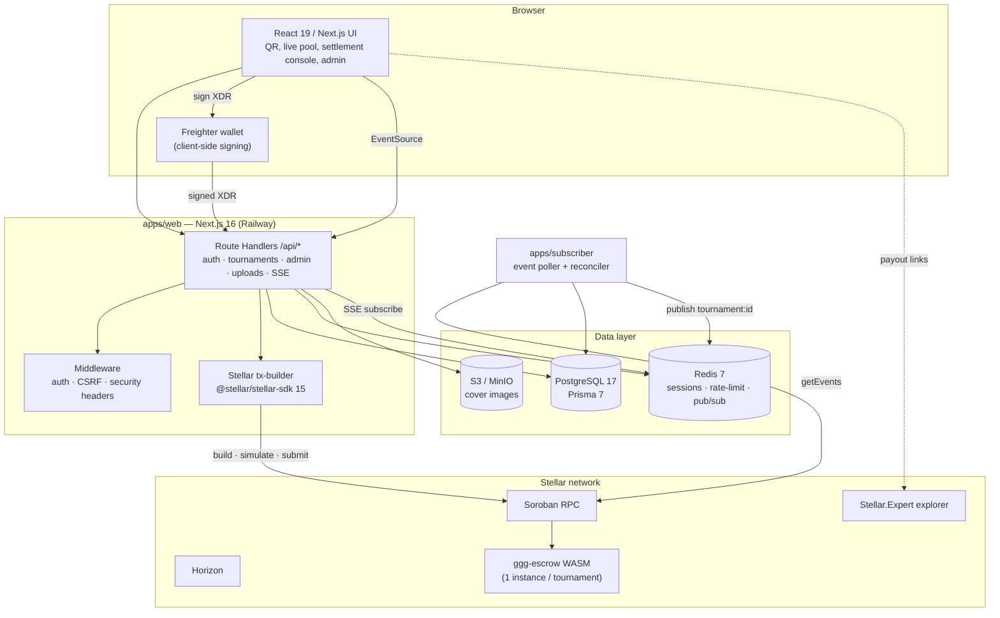
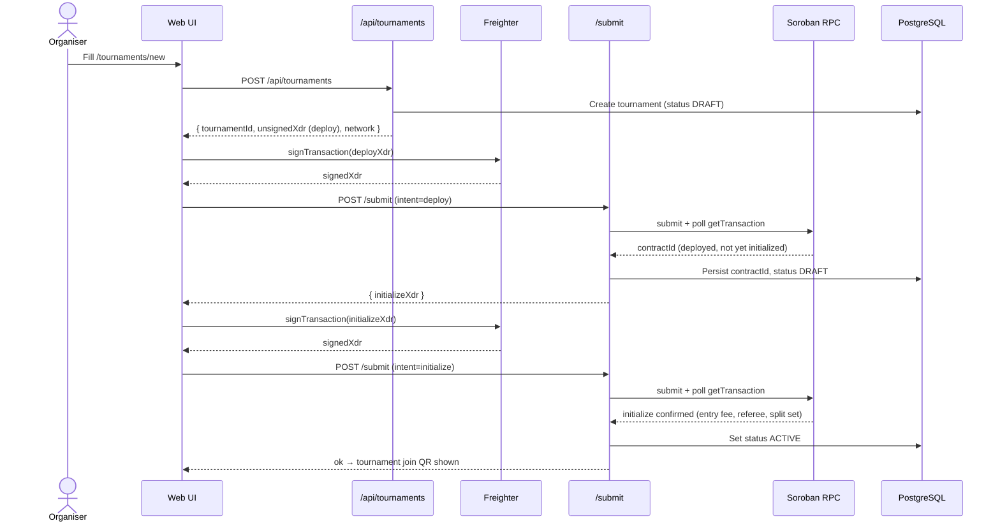
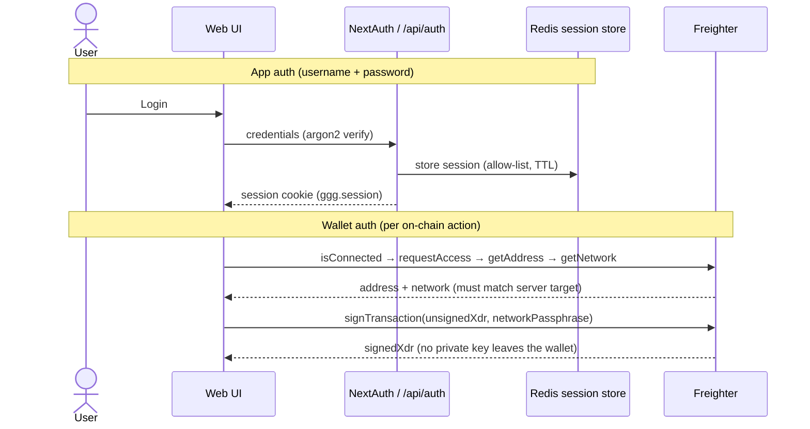
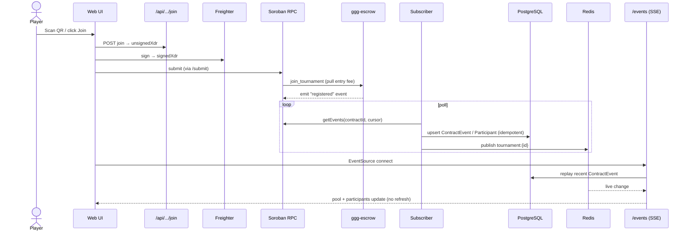

# GGG — Good Game Guild

> Trustless tournament prize-escrow and match-settlement protocol on Stellar Soroban.

GGG solves a problem every paid competitive-gaming event has: someone has to hold the prize pool between "entry fees collected" and "winners paid," and that custodian — an organiser, a Discord admin, a third-party platform — can skim funds, delay payouts, or vanish with the pot. GGG removes the custodian entirely. An **organiser** deploys a dedicated Soroban smart contract per tournament with an entry fee (XLM or USDC) and a payout split (default 60/30/10); **players** join by paying the fee straight into the contract from their own wallet, no account required; a **referee** submits the final standings; and the contract itself — not any person or platform — pays the winners in a single on-chain transaction. Every registration, payout, and refund is a public, independently verifiable Stellar transaction.

For the Stellar ecosystem, GGG is a concrete use case for Soroban: it turns paid tournament escrow into on-chain transaction volume — deployments, entry fees, and payouts — while giving XLM and USDC-on-Stellar a natural consumer flow. It also serves as a reference implementation of the "client signs, server never holds keys" pattern.

---

## Demo

- **Live app:** https://ggg.quest/
- **Demo video:** https://drive.google.com/drive/u/2/folders/14AP_jPxcJG1TzICtBd9eY2c2q2hIwYh0
- **Screenshot:**
  
  
  
  
  
  
  
  
  
  

---

## Status / License

- **Version:** `0.0.0` (workspace manifests) · contract crate `ggg-escrow` `0.1.0`
- **Status:** Live on Stellar Testnet at https://ggg.quest
- **Default network:** Stellar Testnet (`STELLAR_NETWORK=testnet`)
- **Escrow WASM hash:** `56faadf3395536f14b10c263c6369dda77dd2bc3ec9c24c6ce39fada518986ac` (recorded in `apps/web/.env.example`).
- **License:** Released under the MIT License. Copyright © 2026 Artisam Labs.

---

## Problem

Every paid tournament has a pot of money, and today **someone has to hold it** — the organiser or a platform acts as custodian of the entry fees until payout. Per [`SPEC.md`](./SPEC.md) §1, that custody is a single point of trust and failure:

- Funds can be skimmed, delayed, frozen, or disappear.
- Players must trust a stranger to pay out correctly, in full, and on time.
- Grassroots and community tournaments have **no affordable, neutral escrow**.

GGG removes the custodian: **no party holds the funds — the contract does.** Money leaves the escrow **only** via winner payout or refund; there is no withdraw function ([`contracts/escrow/src/lib.rs`](./contracts/escrow/src/lib.rs)).

---

## Vision / Purpose

- **Long-term:** a game-agnostic, trustless prize-escrow and match-settlement protocol for competitive gaming — "any game title," per [`SPEC.md`](./SPEC.md) §1.
- **Why built:** a hackathon-style, spec-driven build ([`SPEC.md`](./SPEC.md) is the authoritative build spec; [`docs/`](./docs) tracks the phased 0–6 roadmap, all of which is now closed).
- **Design principle:** the server never holds a private key. It only builds, simulates, submits, and reads transactions; signing happens client-side in the user's wallet ([`SPEC.md`](./SPEC.md) §7).

---

## Target Users

- **Tournament organisers** — need neutral escrow without becoming (or paying for) a custodian.
- **Players / competitors** — want provable, on-chain payouts and no app account required to join.
- **Referees** — submit final rankings; their authority is enforced on-chain by wallet address.
- **Platform admins** — oversee users and tournaments across the whole platform (role hierarchy: `ADMIN` outranks `ORGANIZER`).
- **Gaming guilds / communities / LAN & arcade events** — run frequent paid brackets that can't justify a custodial platform.

---

## Features

**Tournaments**
- Create a tournament with entry fee, asset (XLM or USDC), referee address, and a 1st/2nd/3rd split stored as basis points that must sum to 10000.
- Public tournament detail page: live prize-pool counter, participant list, winners panel with explorer links.
- Organiser dashboard (list with status chips), referee **settlement console**, admin dashboard.
- Consistent back-navigation (`BackButton`) across tournament, settlement, and admin detail pages.

**On-chain money rails (Soroban)**
- One WASM escrow contract deployed per tournament; entry fees pulled into escrow on join.
- Referee-signed finalisation pays the configured split in a single transaction, with rounding dust deterministically assigned to 1st place.
- Organiser-signed cancellation makes one permissionless refund claim available per registered player.
- Tournament creation is a **two-transaction flow**: the organiser signs a `deploy`, then a second `initialize` transaction that sets the entry fee, referee, and split (see [Known deviations from SPEC.md](#known-deviations-from-specmd) below).

**Wallet + funding**
- Client-side signing via **Freighter** (`@stellar/freighter-api`); server never sees a key.
- **Tournament join QR** on every active tournament; scanning opens GGG's signed `join_tournament` flow, so only registered players fund the escrow ([`SPEC.md`](./SPEC.md) §8).

**Live state**
- Background **event subscriber** polls confirmed Soroban contract events, then pushes updates over **Server-Sent Events (SSE)** — pool and participants update without a refresh.

**Admin (beyond original SPEC.md scope)**
- Full user management: list, view detail, change role, reset password, delete (self-delete/self-demote blocked).
- Full tournament oversight: list all tournaments platform-wide, view/edit metadata, force-cancel.
- Role hierarchy (`ADMIN` can access everything an `ORGANIZER` can; on-chain signing still requires the actual organiser/referee wallet).

**Platform / security**
- Username+password auth: `argon2` hashing, session cookie, revocable Redis session store, CSRF (same-origin) checks, and Redis-backed rate limiting.
- S3-compatible cover-image uploads via presigned URLs (MinIO locally).
- Zod-validated, fail-closed environment loaders in both `apps/web` and `apps/subscriber`.

---

## Architecture



---

## Sequence Diagrams

### 1. Hero flow — create tournament (organiser)

Tournament creation is a **two-transaction** flow: the generated Soroban binding's `deploy()` cannot pass `initialize` arguments in the same call (Soroban contracts expose `initialize` as a regular function, not a constructor), so the organiser signs deploy first, then a second `initialize` transaction actually sets the entry fee, referee, and split. See [`apps/web/src/lib/stellar/builders.ts`](./apps/web/src/lib/stellar/builders.ts) (`buildDeployInitializeTx`) and [`apps/web/src/server/services/tournaments.ts`](./apps/web/src/server/services/tournaments.ts).



### 2. Auth / signing flow (Freighter + credentials)



### 3. Player join + live event propagation (async / SSE)



---

## Smart Contracts

Contract crates found in the repo:

| Crate | Path | Purpose |
|---|---|---|
| `ggg-escrow` | [`contracts/escrow`](./contracts/escrow) | Per-tournament prize escrow: `initialize`, `join_tournament`, `finalize_results`, `cancel_tournament`, `claim_refund`, and read-only `get_pool` / `get_reward` / `is_finished`. Emits `registered` / `finalized` / `cancelled` / `refund_claimed` events. Built with `soroban-sdk` 26. 49 unit tests. |

Function signatures, storage model, events, and security invariants are specified in [`SPEC.md`](./SPEC.md) §4; the source of truth is `contracts/escrow/src/lib.rs` with 49 tests in `contracts/escrow/src/test.rs`.

---

## Known deviations from SPEC.md

- **Two-signature tournament creation**, not one. [`SPEC.md`](./SPEC.md) §6 describes `POST /api/tournaments` as building "the deploy + initialize transaction" as a single unit. The current implementation cannot do this atomically — see the TODO in [`apps/web/src/lib/stellar/builders.ts`](./apps/web/src/lib/stellar/builders.ts) — so it is two organiser-signed transactions (`deploy`, then `initialize`) instead of one. This is being addressed in the current sprint.
- **Admin scope grew beyond SPEC.md.** §5 originally described `/admin` as "user management, platform overview." The shipped admin surface also includes full tournament oversight (list/detail/edit/force-cancel) and a role hierarchy (`ADMIN` ⊇ `ORGANIZER`) — a superset of spec, not a gap.
- **USDC is fully wired but environment-gated.** Asset selector, SAC resolution, and all UI surfaces branch correctly on `"XLM" | "USDC"` — but resolving USDC requires `USDC_ISSUER` / `USDC_SAC_ADDRESS` to be set per network; without them, only XLM resolves.

---

## Tech Stack

Versions are taken from the manifests (`apps/web/package.json`, `apps/subscriber/package.json`, `contracts/escrow/Cargo.toml`).

| Layer | Tech |
|---|---|
| **Frontend** | Next.js `^16.2.9` (App Router), React `^19.2.7`, Tailwind CSS `^4.3.1` (`@tailwindcss/postcss`), shadcn/Radix UI, `lucide-react` (icon system), `qrcode.react` |
| **Backend / API** | Next.js Route Handlers, Zod `^4`, Prisma `^7.8.0` (`@prisma/adapter-pg`), `ioredis`, NextAuth `4.24.14`, `argon2` |
| **Blockchain client** | `@stellar/stellar-sdk` `15`, `@stellar/freighter-api` `^6.0.1` |
| **Smart contract** | Rust, `soroban-sdk` `26`, `stellar-cli` `27.0.0` (CI), compiled to WASM |
| **Storage** | `@aws-sdk/client-s3` + `s3-request-presigner` `^3` (MinIO local / S3-compatible prod) |
| **Data** | PostgreSQL 17, Redis 7 |
| **Subscriber** | TypeScript worker (`tsx`), `@stellar/stellar-sdk`, `ioredis`, Prisma (shared via `web` workspace dep) |
| **Tooling** | pnpm 10 (`pnpm@10.6.4`), Node 22 (`.nvmrc`), TypeScript `^6`, Vitest `^4`, Playwright `^1.61`, ESLint `^9`, Prettier `^3` |
| **CI** | GitHub Actions — `app` job (Postgres+Redis, typecheck/lint/format/tests/integration/build/audit) and `contract` job (stellar-cli build + `cargo test`). Triggers on push to `main` and on `pull_request`; does **not** trigger on a direct push to `develop` — branch protection requiring these checks is a documented one-time manual step, not yet enabled. |
| **Infra / deploy** | Railway (`railway.json` per service), Docker Compose (local), MinIO |

> Note: version numbers reflect this repo's manifests as committed; report them as-is.

---

## How to Run Locally

**Prerequisites:** Node **22+** (`.nvmrc`), **pnpm 10** (via corepack), **Docker**. For contract work: Rust + `stellar-cli`.

```bash
# 1. Enable pnpm and install
corepack enable
pnpm install

# 2. Start local services (Postgres 17, Redis 7, MinIO + bucket bootstrap)
docker compose up -d

# 3. Configure web env
cp apps/web/.env.example apps/web/.env
#   then fill: SESSION_SECRET (>=32), CSRF_SECRET (>=32), ADMIN_PASSWORD (>=8)

# 4. Database: migrate + seed the admin user
pnpm --filter web db:migrate
pnpm --filter web db:seed

# 5. Run the web app  → http://localhost:3000
pnpm --filter web dev

# 6. (Optional) run the event subscriber in a second shell
pnpm --filter subscriber dev
```

**Quality gates (match CI):**

```bash
pnpm -r typecheck
pnpm -r lint
pnpm format:check
pnpm --filter web test
pnpm --filter web test:integration    # needs Postgres + Redis up
pnpm --filter web build               # production build
```

**Contract build & tests:**

```bash
cd contracts/escrow
stellar contract build
cargo test
```

### Environment variables

**`apps/web` — required** (fail-closed, validated by `apps/web/src/lib/env.ts`):
`APP_URL`, `SESSION_SECRET` (≥32), `CSRF_SECRET` (≥32), `DATABASE_URL`, `REDIS_URL`, `ADMIN_USERNAME`, `ADMIN_PASSWORD` (≥8), `STELLAR_NETWORK` (`testnet`|`public`), `SOROBAN_RPC_URL`, `HORIZON_URL`, `NETWORK_PASSPHRASE`, `S3_ENDPOINT`, `S3_REGION`, `S3_BUCKET`, `S3_ACCESS_KEY_ID`, `S3_SECRET_ACCESS_KEY`.

**`apps/web` — optional:** `ESCROW_WASM_HASH`, `NATIVE_SAC_ADDRESS`, `USDC_ISSUER`, `USDC_SAC_ADDRESS`, `S3_FORCE_PATH_STYLE` (default `false`), `NODE_ENV` (default `development`).
- Without `ESCROW_WASM_HASH` / `NATIVE_SAC_ADDRESS`, contract deploy/XLM asset resolution can't be performed.
- Without `USDC_ISSUER` / `USDC_SAC_ADDRESS`, only XLM entry fees resolve; USDC is unavailable.

**`apps/subscriber`** (validated by `apps/subscriber/src/env.ts`): `DATABASE_URL`, `REDIS_URL`, `SOROBAN_RPC_URL`, `HORIZON_URL`, `NETWORK_PASSPHRASE` (all required); `POLL_INTERVAL_MS` (optional, default `5000`), `NODE_ENV` (default `development`).

---

## Deployment

Deploys to **Railway** as three services (configs committed; provisioning/`railway up` is an operator step — see [`RUNBOOK.md`](./RUNBOOK.md)):

| Service | Config | Build | Start / release hook |
|---|---|---|---|
| **web** | [`apps/web/railway.json`](./apps/web/railway.json) | NIXPACKS: `db:generate && build` | `next start`; preDeploy: `prisma migrate deploy && prisma db seed`; healthcheck `/api/auth/me` |
| **subscriber** | [`apps/subscriber/railway.json`](./apps/subscriber/railway.json) | NIXPACKS: `db:generate` | `subscriber start` (`tsx`), `restartPolicy: ALWAYS` |
| **file-storage** | [`infra/file-storage/railway.json`](./infra/file-storage/railway.json) | DOCKERFILE (MinIO) | S3-compatible store on a Railway Volume |

Root `package.json` also exposes `build`/`start` scripts (`pnpm --filter web build|start`) for platform auto-detection.

**CI** ([`.github/workflows/ci.yml`](./.github/workflows/ci.yml)): the `app` and `contract` jobs run on pushes to `main` and on pull requests; they must pass before merge, though branch protection enforcing that is a one-time maintainer step not yet enabled (see `RUNBOOK.md`). Playwright E2E runs out-of-band against Testnet, not on the merge gate.

- **Live web URL:** https://ggg.quest
- **RPC / network:** Testnet by default; switch to `public` (Mainnet) via env.

---

## Team

| Name | Role | Contact |
|---|---|---|
| Neil John E. Rivera | Lead Developer | neiljohn.rivera.work@gmail.com |


---

## License

`Released under the MIT License. Copyright © 2026 Artisam Labs.`

---

### Further reading

- [`SPEC.md`](./SPEC.md) — authoritative build spec (pages, API, contract, flows, acceptance criteria)
- [`AGENT.md`](./AGENT.md) — engineering rules & safety
- [`BRAND.md`](./BRAND.md) — design system
- [`RUNBOOK.md`](./RUNBOOK.md) — deploy & operations
- [`docs/`](./docs) — phased build plans, verification, acceptance, migrations, pitch deck
