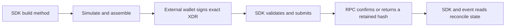

# Escrow SDK Integration Guide

Use `@goodgameguild/escrow-sdk` to build, validate, submit, and read GGG escrow transactions without giving the SDK a private key. Version `0.1.0` supports Node.js 22+ and browser applications.

## Install

```sh
npm install @goodgameguild/escrow-sdk@0.1.0
```

Canonical references:

- [SDK source and README](https://github.com/artisam-ggg/ggg/tree/goodgameguild-escrow-sdk-v0.1.0/packages/escrow-sdk)
- [Complete standalone Node.js example](https://github.com/artisam-ggg/ggg/tree/goodgameguild-escrow-sdk-v0.1.0/examples/nodejs-escrow)
- [Published npm package](https://www.npmjs.com/package/@goodgameguild/escrow-sdk/v/0.1.0)

## Configure Stellar Testnet

```ts
import { EscrowSdk, EscrowSdkError } from "@goodgameguild/escrow-sdk";

const networkPassphrase = "Test SDF Network ; September 2015";
const rpcUrl = "https://soroban-testnet.stellar.org";

const sdk = new EscrowSdk({
  rpcUrl,
  networkPassphrase,
  contractId: "C...", // use wasmHash instead when deploying a new escrow
});
```

The reviewed Testnet WASM hash for this release is:

```text
b704f577f1715d965f9ba24f2cebf49df52735d42c9a4cd2a93781d612a46dd9
```

Testnet may reset. Before deploying, confirm that this code entry and the token SAC still exist. Existing instances must match the SDK's current ABI; use `getEscrowWasmHash(rpcUrl, contractId)` before selecting bindings for an older contract.

## Build, sign, submit, confirm

Every state-changing call follows the same boundary:



**Text alternative:** The SDK builds, simulates, and assembles a transaction. An external wallet signs that exact XDR. The SDK validates the signed body and wallet-reported network, submits it, waits for confirmation, and then the application reconciles confirmed state.

```ts
const built = await sdk.buildJoin(playerAddress);

// Implement this with Freighter, another wallet, or an external signing service.
const walletNetworkPassphrase = await wallet.getNetworkPassphrase(playerAddress);
const signedXdr = await wallet.signTransaction(
  built.xdr,
  built.networkPassphrase,
);

const result = await sdk.submit(signedXdr, built, walletNetworkPassphrase);
if (result.status !== "SUCCESS") {
  throw new Error(`Transaction failed: ${result.hash}`);
}

const players = await sdk.readPlayers(playerAddress);
const poolStroops = await sdk.readPool(playerAddress);
```

Keep the returned `BuiltEscrowTransaction` unchanged until submission. Do not rebuild from client-supplied fields after the user signs. Transaction XDR contains no network identifier, so pass the network actually reported by the wallet to `submit`.

The SDK never needs a seed phrase or private key. Do not put secrets, signed XDR, database URLs, npm tokens, or signer errors in source control or logs.

## Deploy a tournament escrow

Create a deployment client with `wasmHash` instead of `contractId`, then provide all constructor terms:

```ts
const deploySdk = new EscrowSdk({
  rpcUrl,
  networkPassphrase,
  wasmHash:
    "b704f577f1715d965f9ba24f2cebf49df52735d42c9a4cd2a93781d612a46dd9",
});

const deployment = await deploySdk.buildDeploy(organizerAddress, {
  referee: refereeAddress,
  token: nativeXlmSacId,
  entryFee: 10_000_000n,
  distributionBps: [6000, 3000, 1000],
  settlementDeadline: BigInt(Math.floor(Date.now() / 1000) + 3600),
  salt: crypto.getRandomValues(new Uint8Array(32)),
});
```

`entryFee` is an integer number of token stroops: `10_000_000n` is 1 XLM. `settlementDeadline` is an integer UTC Unix timestamp in seconds. The distribution contains 1–10 positive integer basis-point entries and must total 10,000. The confirmed deployment result supplies the new `contractId`.

For XLM, use the Testnet native SAC contract ID. `resolveSacAddress("XLM", networkPassphrase, { nativeSacAddress })` requires that explicit ID. Other tokens require their Testnet SAC and funded participant balances.

## Join, settle, and read payouts

Use a client configured with the deployed `contractId`:

```ts
const join = await sdk.buildJoin(playerAddress);
const settlement = await sdk.buildFinalize(refereeAddress, [
  firstPlace,
  secondPlace,
  thirdPlace,
]);

const tournament = await sdk.readTournament(readSourceAddress);
const finished = await sdk.readFinished(readSourceAddress);
const firstReward = await sdk.readReward(readSourceAddress, firstPlace);
const remainingPool = await sdk.readPool(readSourceAddress);
```

The winner array is ordered by rank, must contain registered unique players, and must match the configured distribution length. Rewards use integer arithmetic: each rank receives `floor(pool × bps / 10000)`, and any rounding dust is assigned to first place.

Reads require a public source address for RPC simulation but no signature. A completed settlement should report `finished=true`, the expected ordered rewards, and a zero remaining pool.

## Cancellation and deadline refunds

Settlement and refund are alternative terminal outcomes for one escrow. Use separate contract instances when demonstrating them.

```ts
// Before the deadline, the organizer may cancel.
const cancellation = await sdk.buildCancel(organizerAddress);

// After cancellation, or at/after an active tournament's inclusive deadline,
// any funded source may pay the transaction fee for a registered player.
const claim = await sdk.buildClaimRefund(delegateAddress, playerAddress);
```

The `source` signs and pays network/resource fees. The contract always transfers the entry fee to the registered `player`, not to the delegate. Each player can claim once. Cancellation opens claims immediately; an active tournament opens deadline claims at or after its stored deadline. Neither path is valid after finalization.

For the generated low-level binding, the current WASM also exposes `claim_refund_after_deadline({ player })`. Use it only with an instance deployed from this ABI. The high-level example uses `buildClaimRefund` for the application's shared claim path.

## Confirmation and error handling

`submit` returns `{ hash, status: "SUCCESS" | "FAILED", contractId? }`. A confirmed `FAILED` result means ledger execution failed. A timeout or lookup failure is uncertain, not a safe retry signal:

```ts
try {
  await sdk.submit(signedXdr, built, walletNetworkPassphrase);
} catch (error) {
  if (error instanceof EscrowSdkError && error.hash) {
    const current = await sdk.lookup(error.hash, built.intent);
    // Keep polling while PENDING. Do not send a different transaction blindly.
  }
}
```

Stable error codes are `INVALID_INPUT`, `NETWORK_MISMATCH`, `SIMULATION_FAILED`, `SUBMIT_REJECTED`, `TX_TIMEOUT`, and `CONFIRMATION_FAILED`. Display the safe code/message, retain any transaction hash for reconciliation, and diagnose wallet or signer details privately.

Common causes include:

- a wallet connected to a network whose passphrase differs from the SDK;
- invalid public keys, contract IDs, amounts, winner counts, or BPS totals;
- stale account sequence numbers or an underfunded transaction source;
- joining, finalizing, or cancelling at/after the deadline;
- using generated bindings against a contract with another WASM hash;
- missing or archived Testnet WASM/instance entries after a reset;
- treating `PENDING`, `TX_TIMEOUT`, or `CONFIRMATION_FAILED` as proof of failure.

## Run the complete Node.js example

Clone the [public repository](https://github.com/artisam-ggg/ggg), use Node.js 22+, and follow [`examples/nodejs-escrow/README.md`](https://github.com/artisam-ggg/ggg/tree/goodgameguild-escrow-sdk-v0.1.0/examples/nodejs-escrow). The offline smoke test needs no funded account:

```sh
pnpm install --frozen-lockfile
node examples/nodejs-escrow/smoke.mjs
```

The live command uses your own funded Testnet identities and external signer:

```sh
cd examples/nodejs-escrow
npm install --no-save --package-lock=false @goodgameguild/escrow-sdk@0.1.0
cp .env.example .env
npm run live
```

In PowerShell, use `Copy-Item .env.example .env` instead of `cp`.

The live runner creates separate settlement, deadline-refund, and cancellation-refund instances. It prints only public addresses, contract IDs, transaction hashes, rewards, and explorer links. Funded execution spends Testnet assets and should be run only by an authorized operator.

See the [D3 evidence](../deliverables/d3.md) for the independently verified public release run.
