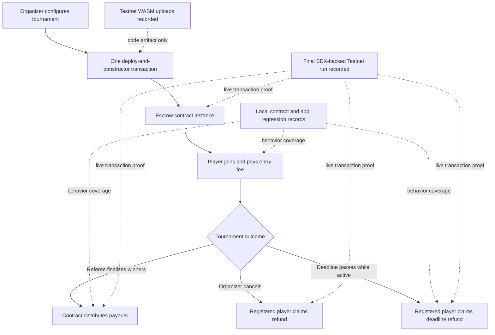

# Escrow Flow and Evidence Map

This diagram summarizes the escrow paths described by the public contract source and the evidence boundary for this milestone record.

## How to read the diagram

- Solid arrows describe the intended escrow lifecycle in the SOW and current contract model.
- Dashed arrows distinguish evidence types. The recorded Testnet transactions prove code uploads; the recorded regression results prove local/reproducible behavior coverage.
- The final SDK-backed transaction trail proves deployment, funded joins, ranked payout, delegated deadline refund, and cancellation refund on distinct instances.

**Text alternative:** An organizer configures and deploys a tournament escrow,
a player joins by paying the entry fee, then either a referee finalizes winners
for payout, an organizer cancels for refunds, or the settlement deadline passes
for a deadline refund. Earlier code uploads and regression tests support the
implementation, while the final SDK-backed Testnet run records live examples of
all three terminal outcomes on distinct contract instances.

## Source-backed interface illustration

The image is a committed [public GGG repository asset](https://github.com/artisam-ggg/ggg/blob/7999b30f9a35b771de2e6089ac4fa4f33f7d5667/homepage/home.png). It illustrates the tournament experience only; the [Evidence index](evidence.md) remains the source for Testnet artifact proof.

See [D1](../deliverables/d1.md), [D2](../deliverables/d2.md), [D3](../deliverables/d3.md), and the [Evidence index](evidence.md) for the exact public links.
