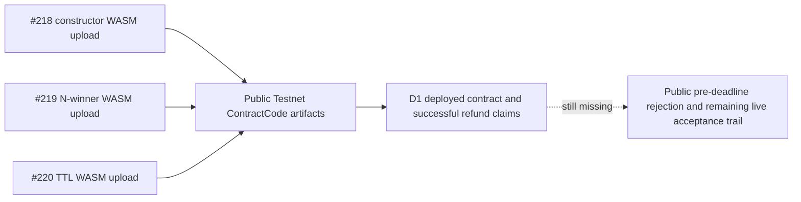

# Evidence Index

## Recorded Testnet artifacts

| Evidence | Source revision | Testnet artifact | What it proves | What it does not prove |
| --- | --- | --- | --- | --- |
| [#218 constructor upload](https://github.com/artisam-ggg/ggg/blob/ee1cb8e53624c31465cae20124f3790e9083a886/docs/verification/issue-218-testnet-evidence.md) | `98b8619` | [Upload transaction](https://stellar.expert/explorer/testnet/tx/ff16ac0b5996b09033383457657508b3057b14eb0575c7ea29e93b3a7908e181) · WASM `6cd5beaee7382d6033b09b19f741d41e2f499651a3804ad81be0a4ede39c5b72` | Constructor WASM upload and matching `ContractCode` record | Contract deployment, join, or refund |
| [#219 N-winner upload](https://github.com/artisam-ggg/ggg/blob/eb1281808c63126a2ce6b243c6ba2cd753f41292/docs/verification/issue-219-payout-evidence.md) | `d22509f` | [Upload transaction](https://stellar.expert/explorer/testnet/tx/a58f34a3aad7ff7d6d065c194e308a243bde0ba95c947ded6f26e87ca52a8e7d) · WASM `1356f43a70552178836e1028aab105c113f863a51a51dd72a094a6bf643d3e2d` | N-winner WASM upload and matching `ContractCode` record | Deployed instance or live payout |
| [#220 TTL upload](https://github.com/artisam-ggg/ggg/blob/118864cb36b668afb2bd00a7944715176fae9f99/docs/verification/issue-220-ttl-evidence.md) | `d590b36` | [Upload transaction](https://stellar.expert/explorer/testnet/tx/5498ee96135a2d485791c21a001771e9bedf572a790267461c99abea122f74bf) · WASM `2dcfb4c3ed77863269a347308156021de08427f5e6aa77ba15a08d9476c03f77` | TTL WASM upload and matching `ContractCode` record | Deployed instance, live payout, or full end-to-end flow |
| D1 deadline-route refund | [Contract `CCEZ…ZFZA`](https://stellar.expert/explorer/testnet/contract/CCEZLQUWJXU7YRCGZWKKP4G352BLDAGE4EAEH7GGMNAC6H5XFE6CZFZA) | Successful [`refund_claimed` transaction 1](https://stellar.expert/explorer/testnet/tx/f435162b1cc7f0ac137527f6340a4d1bede8d12a38ac3d8f18c2e3896b457da2) · [transaction 2](https://stellar.expert/explorer/testnet/tx/8082490e8962e1698764c2be5f5e6603e97309d153cf688da3f507c7a09df32d) | Successful refund claims. With the retained event sequence (no `cancelled` or `finalized` event) and public source, this supports the deadline-refund route. | Rejection before the deadline, or a complete end-to-end acceptance trail |

## Public endpoint observation

The book lists [ggg.quest](https://ggg.quest/) and [beta.ggg.quest](https://beta.ggg.quest/) as public endpoints. An unauthenticated check of the beta root URL, [`https://beta.ggg.quest/`](https://beta.ggg.quest/), returned HTTP 200 on 18 September 2026. The `/health` endpoint was not checked. This is an availability observation only; it does not establish which contract artifact is configured or that an SOW acceptance flow has completed.

## Evidence at a glance

The three public uploads independently verify code artifacts. Separately, D1 has a deployed-contract event trail with successful refund claims. Public proof of the pre-deadline rejection and the remaining deliverables' live flows is still required.

**Text alternative:** Three separate public Testnet uploads (#218 constructor, #219 N-winner, and #220 TTL) establish code artifacts. D1 also has a public deployed contract with two successful refund-claim transactions. The public event history and source support the deadline route, while a pre-deadline rejection and the other deliverables' live flows remain unproven.

## Evidence sources

- [Constructor WASM-upload evidence — #218](https://github.com/artisam-ggg/ggg/blob/ee1cb8e53624c31465cae20124f3790e9083a886/docs/verification/issue-218-testnet-evidence.md) — does not prove a refund.
- [N-winner payout evidence — #219](https://github.com/artisam-ggg/ggg/blob/eb1281808c63126a2ce6b243c6ba2cd753f41292/docs/verification/issue-219-payout-evidence.md)
- [TTL evidence — #220](https://github.com/artisam-ggg/ggg/blob/118864cb36b668afb2bd00a7944715176fae9f99/docs/verification/issue-220-ttl-evidence.md)
- [Regression evidence — #221](https://github.com/artisam-ggg/ggg/blob/33c8d68ed28f1a4cdce17d2a513c136106f27347/docs/verification/issue-221-regression-evidence.md)
- [End-to-end acceptance record](https://github.com/artisam-ggg/ggg/blob/89f831993f9a4a75eb7b30fbf1c481666bbb3c73/docs/verification/e2e-acceptance.md)

## Add before marking final completion

- Atomic deploy-and-initialize transaction and resulting contract ID
- Public evidence of a rejected D1 refund before the deadline
- A live N-winner payout transaction
- SDK package URL, version, and successful example output
- Redeployed app health check and end-to-end Testnet flow
- Public demo and integration guide, if submitted as the Week 4 package
