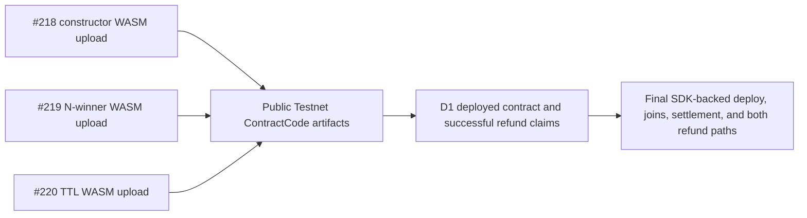

# Evidence Index

## Final SDK-backed release run

The Epic 3 release completed on 24 September 2026 from public revision
[`15902cf`](https://github.com/artisam-ggg/ggg/commit/15902cfdd626d0d5e6629f10b01990dc9dc5cd4c).

| Evidence | Public artifact | What it proves |
| --- | --- | --- |
| Published SDK | [`@goodgameguild/escrow-sdk@0.1.0`](https://www.npmjs.com/package/@goodgameguild/escrow-sdk/v/0.1.0) · [immutable source tag](https://github.com/artisam-ggg/ggg/tree/goodgameguild-escrow-sdk-v0.1.0/packages/escrow-sdk) | The reviewed package is publicly installable from source revision `26f41f0` |
| Standalone consumer | [Node.js example](https://github.com/artisam-ggg/ggg/tree/goodgameguild-escrow-sdk-v0.1.0/examples/nodejs-escrow) · [recorded Testnet run](https://github.com/artisam-ggg/ggg/blob/staging/docs/verification/issue-225-node-example-testnet.md) | A consumer outside the web app uses the package for settlement and both refund paths |
| Matching deployment | [Public app](https://app.ggg.quest/) · [health](https://app.ggg.quest/api/health) · WASM `b704f577…a46dd9` | The SDK-backed web/subscriber release was available at revision `15902cf`; health returned HTTP 200 |
| Public CI | [`develop` run 35977199117](https://github.com/artisam-ggg/ggg/actions/runs/35977199117) · [`staging` run 35977199084](https://github.com/artisam-ggg/ggg/actions/runs/35977199084) | App and contract jobs passed against the exact public release revision |
| Demo | [Edited full-flow video](https://drive.google.com/file/d/1NvTigSXywA8Uk5PpIhEwdjDpWx_DfKmd/view?usp=sharing) | Reviewer-facing recording of the deployed Testnet flows; anonymous access was verified |

### Ranked settlement

Contract [`CBY7…OK3B`](https://stellar.expert/explorer/testnet/contract/CBY7HPZHB3LNCZOB6LP6HAL5YF6DI3VZCACLI6H5K72ETI6ZFKDKOK3B):
[deploy](https://stellar.expert/explorer/testnet/tx/22762e0b0bdc585d2b66ab1846a50e1875f49556be3666330eab3b06d6795f84),
[join 1](https://stellar.expert/explorer/testnet/tx/2fb64da7396627d320391af23a37392a1bcad2fd72356c398f0d09846fc1fa33),
[join 2](https://stellar.expert/explorer/testnet/tx/bb7675d732cbe378ac9688352adb61f05564c6b7d9c2ac06b8c334c3dd24eca8),
[join 3](https://stellar.expert/explorer/testnet/tx/7f6f04488a2e347911200e33b93acd9e756f603b8c371c554b58757000918ae5), and
[finalize](https://stellar.expert/explorer/testnet/tx/90993d06843ab13368384105a51caba3fef4d48d3ebc1f134e5a19f4b72ef2df).
The decoded event and SDK reads confirm ordered 60/30/10 rewards of 18,000,000,
9,000,000, and 3,000,000 stroops and a zero remaining pool.

### Delegated deadline refund

Contract [`CDMX…XTMG`](https://stellar.expert/explorer/testnet/contract/CDMX6F5ORKJW4QC6XNIQUWKRNCVVXISDW3JPIMQHHCYCFCPV6ZX3XTMG):
[deploy](https://stellar.expert/explorer/testnet/tx/d5db990d9b63c2616491d93f2ee111c1265bf37b91fa98ccf421991d168cf1d6),
[join](https://stellar.expert/explorer/testnet/tx/12950cfa1d90a7e1be15f34867b2cc6d9a69c75ec6a313a81f277ad44fbd208e), and
[delegated refund](https://stellar.expert/explorer/testnet/tx/6dfba78cadd0d795da9732a6313a0f4563440d571a6930b89f4944c81ba8fefc).
The claim succeeded after the inclusive `2026-09-24T07:41:00Z` deadline,
paid the registered player 10,000,000 stroops, and left a zero pool.

### Cancellation and refund

Contract [`CCGV…RMZM`](https://stellar.expert/explorer/testnet/contract/CCGVI63KHBRG4CVKM7VPAGBPCER3EJKCN5LDI4NH5ONSR3FQU3ZQRMZM):
[deploy](https://stellar.expert/explorer/testnet/tx/91f22c59e8afceb0ce38589672b5ae670172c587201333177f3c105bf7d03aa1),
[join](https://stellar.expert/explorer/testnet/tx/fb8d4930063f7e1ec7c6554b01d9d17aae6129bbb7a8cfb0a2e8b15c3a05830b),
[cancel](https://stellar.expert/explorer/testnet/tx/678402a0947dff30a4740091d4bf75ff249075d2feca4690709ee411c8a568fc), and
[refund](https://stellar.expert/explorer/testnet/tx/36cf32d24698a5c83b6312ae1d5920349fea3587b1d810b699fe626091110c57).
The decoded events and SDK reads confirm cancellation, one claimed refund of
10,000,000 stroops, and a zero pool.

The [full release record](https://github.com/artisam-ggg/ggg/blob/staging/docs/instawards-evidence.md)
contains role addresses, balances, deployment IDs, event values, and proof
boundaries. Testnet resets can invalidate these artifacts as current
configuration; they remain historical evidence of the recorded run.

## Earlier Testnet artifacts

| Evidence | Source revision | Testnet artifact | What it proves | What it does not prove |
| --- | --- | --- | --- | --- |
| [#218 constructor upload](https://github.com/artisam-ggg/ggg/blob/ee1cb8e53624c31465cae20124f3790e9083a886/docs/verification/issue-218-testnet-evidence.md) | `98b8619` | [Upload transaction](https://stellar.expert/explorer/testnet/tx/ff16ac0b5996b09033383457657508b3057b14eb0575c7ea29e93b3a7908e181) · WASM `6cd5beaee7382d6033b09b19f741d41e2f499651a3804ad81be0a4ede39c5b72` | Constructor WASM upload and matching `ContractCode` record | Contract deployment, join, or refund |
| [#219 N-winner upload](https://github.com/artisam-ggg/ggg/blob/eb1281808c63126a2ce6b243c6ba2cd753f41292/docs/verification/issue-219-payout-evidence.md) | `d22509f` | [Upload transaction](https://stellar.expert/explorer/testnet/tx/a58f34a3aad7ff7d6d065c194e308a243bde0ba95c947ded6f26e87ca52a8e7d) · WASM `1356f43a70552178836e1028aab105c113f863a51a51dd72a094a6bf643d3e2d` | N-winner WASM upload and matching `ContractCode` record | Deployed instance or live payout |
| [#220 TTL upload](https://github.com/artisam-ggg/ggg/blob/118864cb36b668afb2bd00a7944715176fae9f99/docs/verification/issue-220-ttl-evidence.md) | `d590b36` | [Upload transaction](https://stellar.expert/explorer/testnet/tx/5498ee96135a2d485791c21a001771e9bedf572a790267461c99abea122f74bf) · WASM `2dcfb4c3ed77863269a347308156021de08427f5e6aa77ba15a08d9476c03f77` | TTL WASM upload and matching `ContractCode` record | Deployed instance, live payout, or full end-to-end flow |
| D1 deadline-route refund | [Contract `CCEZ…ZFZA`](https://stellar.expert/explorer/testnet/contract/CCEZLQUWJXU7YRCGZWKKP4G352BLDAGE4EAEH7GGMNAC6H5XFE6CZFZA) | Successful [`refund_claimed` transaction 1](https://stellar.expert/explorer/testnet/tx/f435162b1cc7f0ac137527f6340a4d1bede8d12a38ac3d8f18c2e3896b457da2) · [transaction 2](https://stellar.expert/explorer/testnet/tx/8082490e8962e1698764c2be5f5e6603e97309d153cf688da3f507c7a09df32d) | Successful refund claims. With the retained event sequence (no `cancelled` or `finalized` event) and public source, this supports the deadline-refund route. | Rejection before the deadline, or a complete end-to-end acceptance trail |

## Public endpoint observation

The SDK-backed application is [app.ggg.quest](https://app.ggg.quest/). Its
[`/api/health`](https://app.ggg.quest/api/health) endpoint returned HTTP 200
after the matching web and subscriber deployments on 24 September 2026. The
health result establishes availability; the transaction and event trail above
separately establishes the live escrow flows.

## Evidence at a glance

The three earlier public uploads independently verify code artifacts. D1 has a
separate deployed-contract event trail with successful refund claims. The final
Epic 3 run adds public SDK-backed deployment, join, settlement, deadline-refund,
and cancellation-refund evidence. Public proof of a rejected pre-deadline D1
call remains outside the completed D3 trail.

**Text alternative:** Three earlier Testnet uploads establish constructor,
N-winner, and TTL code artifacts. D1 separately records successful refund
claims. The final Epic 3 run records SDK-backed deployment, three joins and
ranked settlement, a delegated deadline refund, and a cancellation refund on
three distinct contracts. A rejected pre-deadline D1 call is still not public.

## Evidence sources

- [Constructor WASM-upload evidence — #218](https://github.com/artisam-ggg/ggg/blob/ee1cb8e53624c31465cae20124f3790e9083a886/docs/verification/issue-218-testnet-evidence.md) — does not prove a refund.
- [N-winner payout evidence — #219](https://github.com/artisam-ggg/ggg/blob/eb1281808c63126a2ce6b243c6ba2cd753f41292/docs/verification/issue-219-payout-evidence.md)
- [TTL evidence — #220](https://github.com/artisam-ggg/ggg/blob/118864cb36b668afb2bd00a7944715176fae9f99/docs/verification/issue-220-ttl-evidence.md)
- [Regression evidence — #221](https://github.com/artisam-ggg/ggg/blob/33c8d68ed28f1a4cdce17d2a513c136106f27347/docs/verification/issue-221-regression-evidence.md)
- [End-to-end acceptance record](https://github.com/artisam-ggg/ggg/blob/89f831993f9a4a75eb7b30fbf1c481666bbb3c73/docs/verification/e2e-acceptance.md)

## Remaining proof boundary outside D3

- D1 still lacks a public transaction result showing rejection before the
  inclusive deadline. Contract tests cover that boundary, but it is not claimed
  as public live evidence here.
- Mainnet deployment and a third-party security audit remain out of scope.
