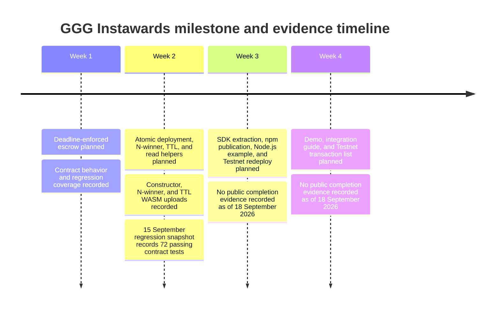

# Milestone and Evidence Timeline

This timeline separates the SOW's planned sequence from the evidence currently recorded in the public milestone package.

**Text alternative:** The SOW schedules D1 in Week 1, D2 in Week 2, D3 in Week 3, and a validation package in Week 4. Public evidence currently records code uploads and local/reproducible tests for the earlier contract work. It does not record the planned SDK/redeploy package or final demo/transaction package.

## Evidence chronology

| Stage | Recorded evidence | Current evidence boundary |
| --- | --- | --- |
| D1 / Week 1 | Constructor upload record and regression coverage | No deployed contract ID or live deadline-refund transaction |
| D2 / Week 2 | Constructor, N-winner, and TTL uploads; regression snapshot dated 15 September 2026 | No live deploy-and-initialize transaction, contract ID, or N-winner payout |
| D3 / Week 3 | SOW requirement and verification procedure | No public npm package, runnable example, matching redeploy, health result, demo, or E2E result |
| Week 4 validation | SOW requirement | No public demo, integration guide, or complete transaction list |

For the exact artifacts, hashes, and public Testnet links, use the [Evidence index](evidence.md).
