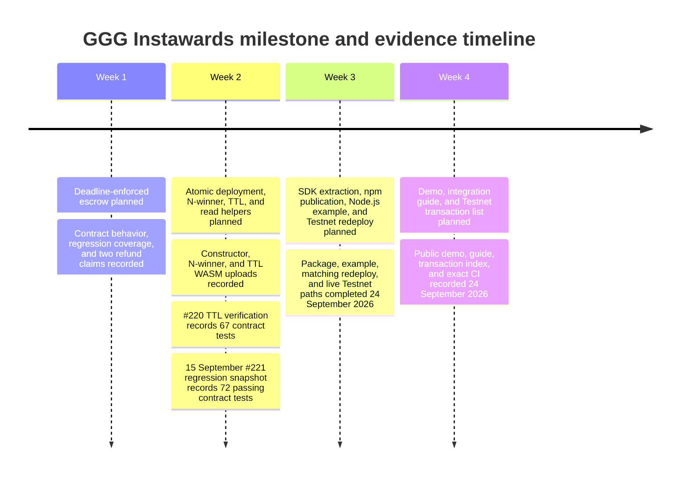

# Milestone and Evidence Timeline

This timeline separates the SOW's planned sequence from the evidence currently recorded in the public milestone package.

**Text alternative:** The SOW schedules D1 in Week 1, D2 in Week 2, D3 in Week
3, and a validation package in Week 4. Earlier evidence records code uploads,
tests, and successful D1 refund claims. The 24 September release adds the npm
SDK, example, matching deployment, ranked settlement, both refund paths, public
demo, guide, and CI. Public proof of a rejected pre-deadline D1 call remains
absent.

## Evidence chronology

| Stage | Recorded evidence | Current evidence boundary |
| --- | --- | --- |
| D1 / Week 1 | Constructor upload, regression coverage, deployed contract, and two successful refund claims | Public proof of a rejected pre-deadline refund call is still absent |
| D2 / Week 2 | Constructor, N-winner, and TTL uploads; regression suite; final constructor deployment, contract ID, three joins, and 60/30/10 payout | Live TTL boundaries remain test-backed rather than directly measured |
| D3 / Week 3 | Public npm package/source, Node example, matching web/subscriber deploy, health, exact CI, and three terminal Testnet paths | Completed; Testnet-reset warning applies |
| Week 4 validation | Public demo, SDK integration guide, and complete final transaction index | Completed; Mainnet/audit claims remain out of scope |

For the exact artifacts, hashes, and public Testnet links, use the [Evidence index](evidence.md).
